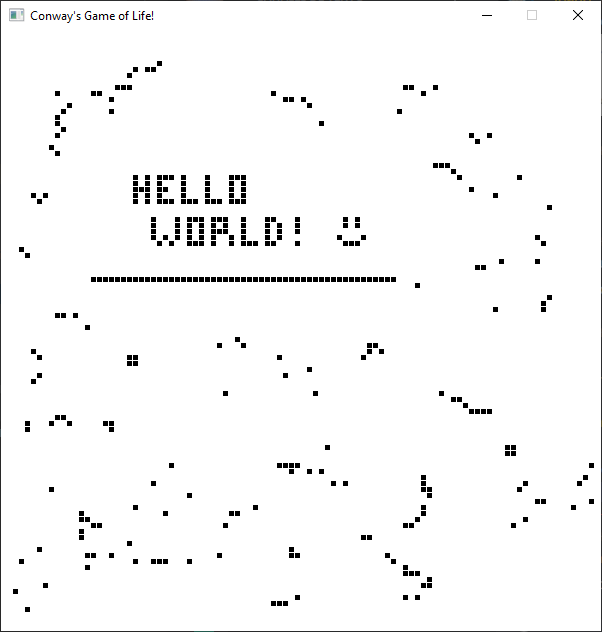
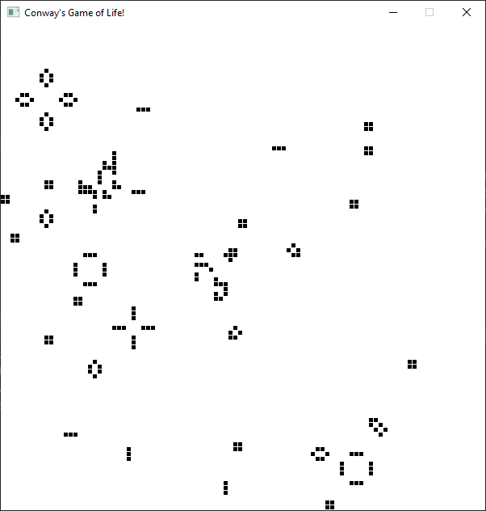
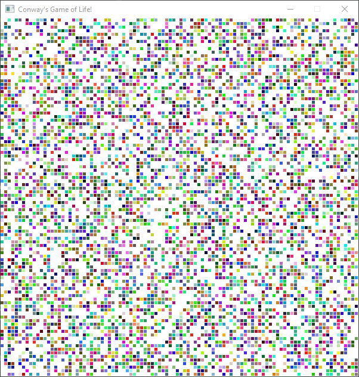
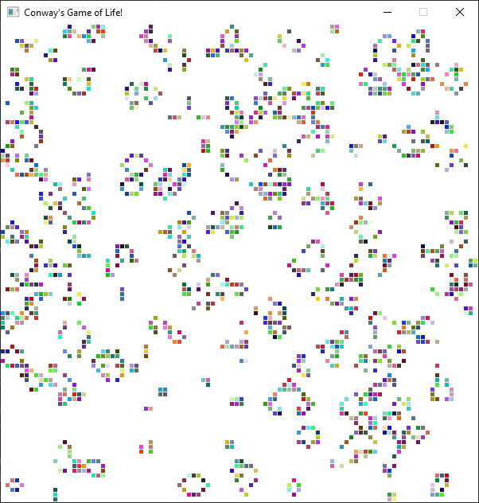

# Conway's-Game-of-Life


## Build instructions
To build the project just use
```
cargo build
```

## Run instructions
To run the project you can do
```
cargo run [options]
```
**[options]**

You can run the program with the following options, the order in the command line doesn't matter
* colorful, c ----- The cells will appear with random colors
* random, r ----- The game will start with a random state

[TODO] read from file

Without options the game will start in default settings (empty board and black cells)


## Game
Once the game starts, you can click the cells you want to activate. When you are ready, 
you can start the game with ```return``` and pause it with ```p```.
While the simulation is running you can still activate cells (though they may disappear soon if alone).
 Also, you can zoom in with the mouse wheel. If you want to move while zoomed in, you can do so with the keyboard arrows.

## Implementation
 The game was made entirely with Rust using Piston. This is the first project for me in Rust, so if you have any suggestions feel free to give feedback.


## License
This project is under the MIT License

## Photos




